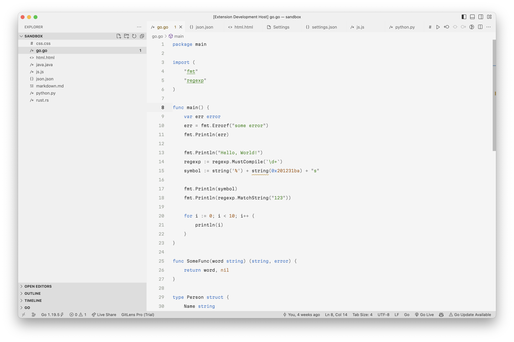

# Magalie theme
Minimalistic theme for vs code with emphasis on readability and UI experience

## Motivation
Shares the same motivation as Alabaster and Chalice themes, but is made with an emphasis on more traditional programming languages rather than lisps.

Magalie higlights only:
- Keywords
- Strings
- Constants, numbers
- Comments
- logical operators, chars

Adittionally:
* Magalie does highlight keywords, they are not useful in lisp languages, but are in others. Highlighting them makes it easier to read code, because it creates a reference point for the eyes.

* Magalie does not highlight comments, because large code bases have absolutely redundant comments, we need to hide them at all costs.

* Magalie focuses on UI experience and slightly more up to date (regarding support of new highlight features) compared to Alabaster and Chalice.


## UI Tweaks
Recommended to use with [Chalice Icons](https://marketplace.visualstudio.com/items?itemName=artlaman.chalice-icon-theme)

Consider using these settings to reduce visual noize:
```json
{
    "chaliceIcons.showArrows": true, // show arrows on the left side of the explorer
    "workbench.tree.renderIndentGuides": "none", // hide folder lines in the explorer
    "window.commandCenter": false,
    "editor.minimap.enabled": false,
    "editor.renderLineHighlight": "gutter",
    "editor.smoothScrolling": true,
    "workbench.tree.indent": 10,
    "editor.cursorBlinking": "solid",
    "breadcrumbs.icons": false,
    "outline.icons": false, // disables icons in breadcrumbs

    // scrollbar size (smaller)
    "editor.scrollbar.verticalScrollbarSize": 10,
    "editor.scrollbar.horizontalScrollbarSize": 10,
}
```


## Examples

